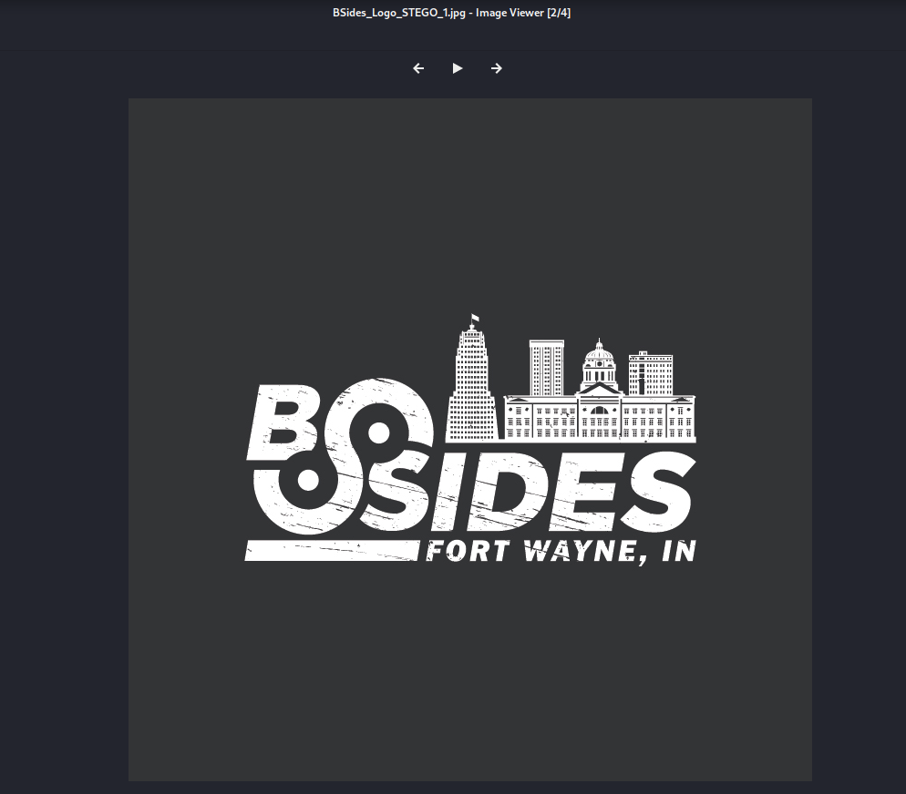
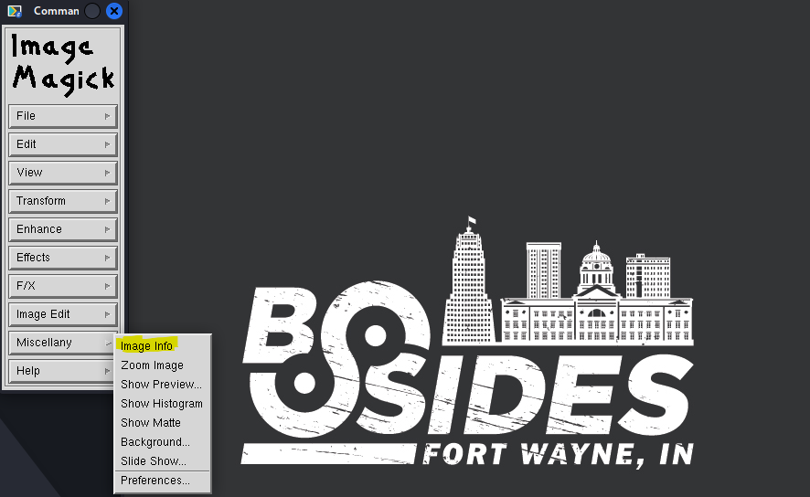
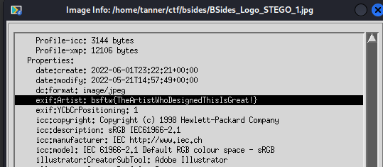

# Escape Artist

**Writeup by:** nitrowv   
**Category:** Steganography  
**Points:** 50

We are given a jpg file, named `BSides_Logo_STEGO_1.jpg`. When we open it in an image viewer, we see that it is simply the conference's logo:



My first instinct in stego challenges like this is to look in the EXIF data and see if there's anything interesting in there, so let's do that.

You can do this a number of ways, but two of the tools that I use are exiftool and ImageMagick, both of which are included in Kali. Exiftool is a command-line tool that outputs the EXIF data in your terminal, while ImageMagick is a GUI program that can be used to manipulate images further.

First, we'll use exiftool. To do this, I use the command `exiftool BSides_Logo_STEGO_1.jpg`, which gives us the following output:

```
┌──(tanner㉿kali)-[~/ctf/bsides]
└─$ exiftool BSides_Logo_STEGO_1.jpg
ExifTool Version Number         : 12.41
File Name                       : BSides_Logo_STEGO_1.jpg
Directory                       : .
File Size                       : 101 KiB
File Modification Date/Time     : 2022:05:21 10:57:49-04:00
File Access Date/Time           : 2022:06:01 19:22:56-04:00
File Inode Change Date/Time     : 2022:06:01 19:22:21-04:00
File Permissions                : -rwxrwxrwx
File Type                       : JPEG
File Type Extension             : jpg
MIME Type                       : image/jpeg
JFIF Version                    : 1.02
Exif Byte Order                 : Big-endian (Motorola, MM)
X Resolution                    : 150
Y Resolution                    : 150
Resolution Unit                 : inches
Artist                          : bsftw{TheArtistWhoDesignedThisIsGreat!}
Y Cb Cr Positioning             : Centered
Displayed Units X               : inches
Displayed Units Y               : inches
XMP Toolkit                     : Adobe XMP Core 7.1-c000 79.a8731b9, 2021/09/09-00:37:38
Format                          : image/jpeg
Title                           : BSides_Logo_FW
Metadata Date                   : 2021:12:30 08:22:23-05:00
Modify Date                     : 2021:12:30 13:22:31Z
Create Date                     : 2021:12:30 08:22:23-05:00
```

In the Artist attribute, we find our flag, which is `bsftw{TheArtistWhoDesignedThisIsGreat!}`.

Doing this in ImageMagick is a similar process. After opening the image, click anywhere in the image window to bring up the command window. EXIF data is found by clicking Image Info in the Miscellany menu.



Scrolling down to the Properties section, we see our flag under the Artist attribute, just as we did using exiftool.


