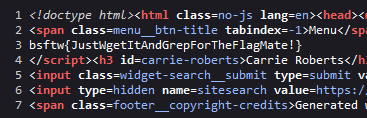

# Use the Source, Luke

**Writeup by:** nitrowv   
**Category:** Web Reconnaissance
**Points:** 50

This challenge tells us that the flag is hidden in the source of one of the pages on the conference's website. Since there are not that many pages on the website, I opted to use the view page source option in Firefox on every page, until finding the following on the Speakers page:

We find the correct flag of: `bsftw{JustWgetItAndGrepForTheFlagMate!}`. And yes, using wget and grep would have been a better way to do it!