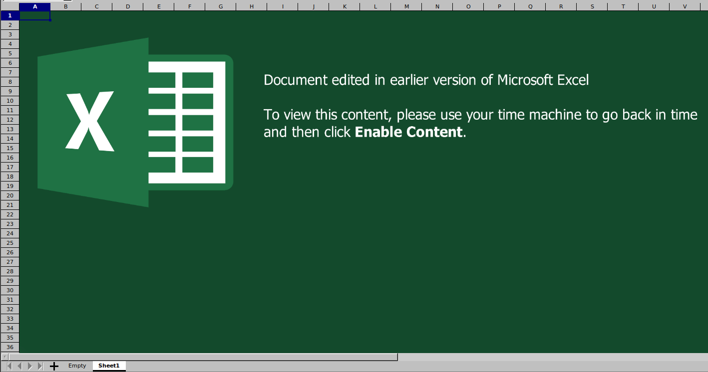
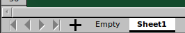
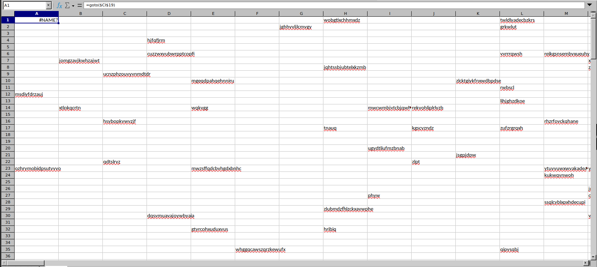
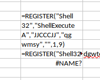
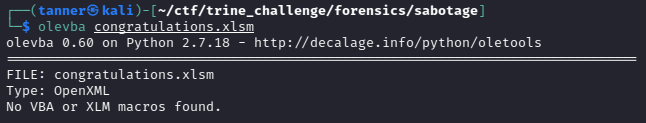
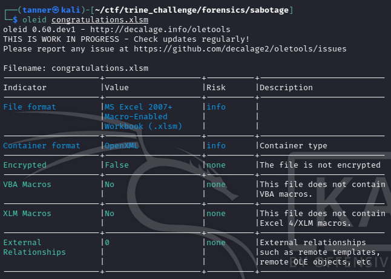
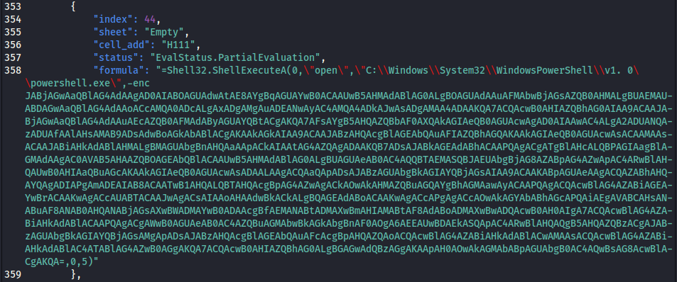
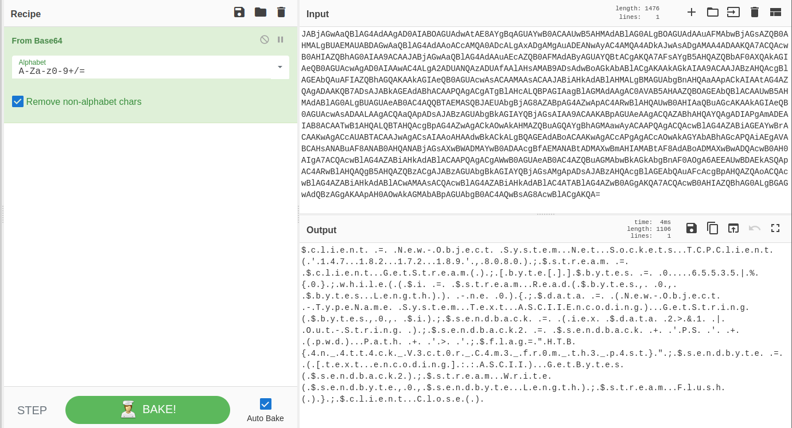
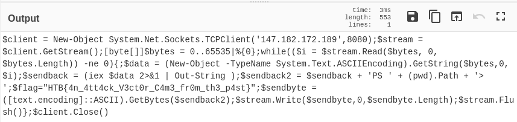

**Category:** Forensics 

**Difficulty:** Easy

We're given a macro-enabled Excel spreadsheet with the file name `congratulations.xlsm`.

Opening the file in LibreOffice Calc, we are greeted by this screen:



At first glance, it appears that there is nothing of interest other than this image that has been overlayed onto the sheet, however, looks can be deceiving...



There is another workspace within this spreadsheet that has been renamed Empty in an attempt to avoid detection. Opening this sheet reveals a lot of cells that contain gibberish as well as a cell that contains what appears to be an XLM function that reads `goto($CI$19)`.



Going to this cell, we see a macro command that creates a shell and generates a command. I continued to follow the trail of commands in the different cells, but not getting any useful information from them.



Knowing that there were macros in this document, I opted to use some command-line tools to help me get a better understanding of what was going on. The first tool I used was olevba, which did not detect any macros. Additionally, oleid did not provide me with any new information.





Knowing that we're dealing with an XLM macro, I did a bit of digging and found [XLMMacroDeobfuscator](https://github.com/DissectMalware/XLMMacroDeobfuscator), a tool created by DissectMalware on GitHub. The script is written in Python and has the ability to not only deobfuscate any macros that it finds, but also output them in the terminal as well as to a JSON file. For the latter, we do this by using the command `xlmdeobfuscator --file congratulations.xlsm --export-json output.json`.

```
XLMMacroDeobfuscator(v0.2.5) - https://github.com/DissectMalware/XLMMacroDeobfuscator

File: /home/tanner/ctf/trine_challenge/forensics/sabotage/congratulations.xlsm

Unencrypted document or unsupported file format
Unencrypted xlsm file

[Loading Cells]
auto_open: auto_open->Empty!$A$1:$A$172
[Starting Deobfuscation]
[END of Deobfuscation]
[Dumping Json]
Result is dumped into output.json
[End of Dumping]
time elapsed: 0.11624884605407715
```

The deobfuscated macro reveals the following as the last function that is called before the return function:



The `-enc` argument appears to be encoded in Base64. Let's decode that, shall we? Some people like to do this in the command line, but I like to do it in CyberChef using the From Base64 operation.

{: width="500" }

Well, we have an output that we *can* read, but it has a bunch of null bytes that make it difficult for us. Luckily for us, CyberChef can help us out with this, using the Remove Null Bytes operation.



Much better! Looking closely at our output, we can see the HTB{} flag format in there, and our flag is:

 `HTB{4n_4tt4ck_V3ct0r_C4m3_fr0m_th3_p4st}`.